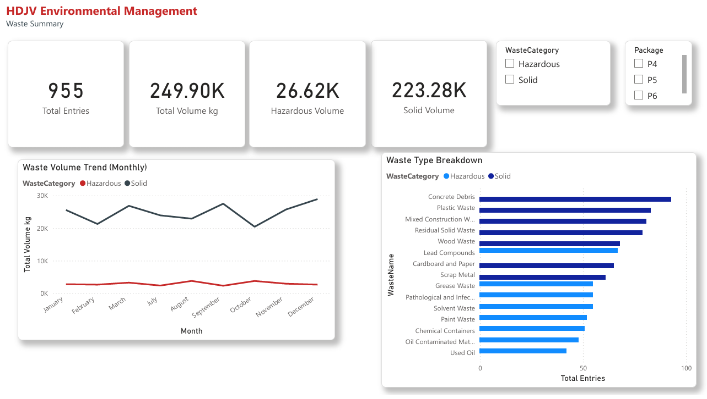
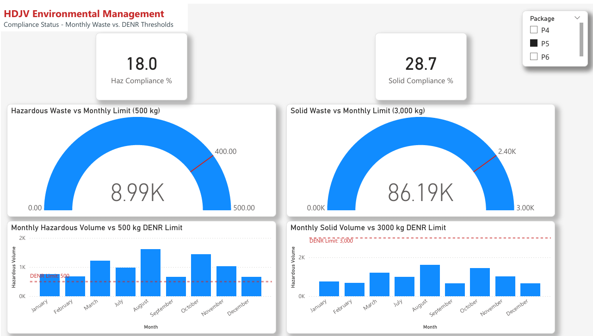
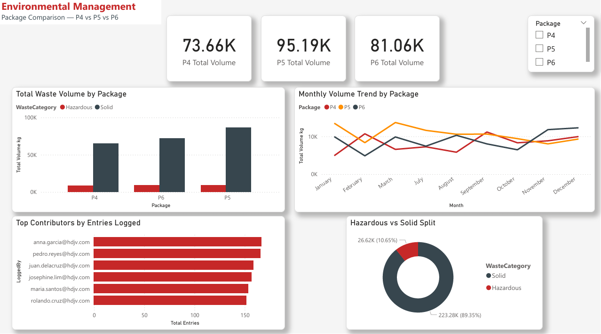

# Environmental Compliance Dashboard

> A 3-page Power BI dashboard for monitoring hazardous and solid waste disposal compliance across construction packages — built on Philippine environmental regulations (RA 6969 / RA 9003).

---

## 📊 Dashboard Preview


> 📄 **[View Full Dashboard (PDF)](WMS_Compliance_Dashboard.pdf)**

---

## Overview

This dashboard was built to address a real gap in construction site environmental monitoring: field waste data exists (logged via the [WMS](https://github.com/francisalbertespina-spec/Waste-log-sandbox)), but there was no management-level view showing compliance status, trends, and package-level comparisons in one place.

The dashboard answers three questions that matter to a Pollution Control Officer (PCO):

1. **How much waste are we generating, and what kind?**
2. **Are we within DENR monthly disposal limits?**
3. **Which construction package needs the most attention?**

---

## Dashboard Pages

### Page 1 — Waste Summary


- KPI cards: Total Entries, Total Volume (kg), Hazardous Volume, Solid Volume
- Monthly trend line chart split by waste category (Hazardous vs Solid)
- Waste type breakdown bar chart ranked by frequency
- Interactive slicers for Package (P4/P5/P6) and Waste Category

### Page 2 — Compliance Status


- Gauge visuals showing current volume vs DENR monthly limits
  - Hazardous: 500 kg/month threshold per RA 6969 / DAO 2013-22
  - Solid: 3,000 kg/month threshold per RA 9003 / DAO 2001-34
- Monthly column charts with red reference line at regulatory limit
- Compliance % cards showing utilization rate against thresholds
- Package slicer for per-package compliance checking

### Page 3 — Package Comparison


- Per-package KPI cards (P4 / P5 / P6 total volumes)
- Clustered column chart comparing waste volumes across packages
- Multi-line trend chart showing each package's monthly trajectory
- Contributor leaderboard (field workers by entries logged)
- Hazardous vs Solid donut chart showing overall waste composition

---

## Regulatory Context

| Regulation | Coverage | Monthly Limit Used |
|---|---|---|
| RA 6969 — Toxic Substances and Hazardous Waste Act | Hazardous waste disposal | 500 kg |
| DAO 2013-22 — Hazardous Waste Management | Manifest requirements, TSD facilities | 500 kg |
| RA 9003 — Ecological Solid Waste Management Act | Solid waste segregation and disposal | 3,000 kg |
| DAO 2001-34 — Solid Waste Management | LGU disposal facility requirements | 3,000 kg |

Thresholds are configured per package (P4, P5, P6) in the `ComplianceThresholds` table of the dataset, making them easy to update if limits change.

---

## Dataset

The Excel dataset (`WMS_PowerBI_Dataset.xlsx`) contains 3 tables:

| Sheet | Rows | Description |
|---|---|---|
| `WasteLog` | 955 entries | Main fact table — one row per disposal entry (Jul 2024 – Mar 2025) |
| `WasteTypes` | 15 waste types | DENR codes, hazard classification, disposal methods |
| `ComplianceThresholds` | 6 rows | Monthly limits per package per waste category |

Data covers 9 months across 3 construction packages (P4, P5, P6) with realistic volumes based on typical Philippine construction site waste generation rates.

---

## Tech Stack

| Tool | Purpose |
|---|---|
| Power BI Desktop | Dashboard development and DAX measures |
| Microsoft Excel | Data source (3-table relational model) |
| DAX | Custom measures (compliance %, package volumes, averages) |

---

## Key DAX Measures

```dax
-- Total waste volume
Total Volume kg = SUM(WasteLog[Volume_kg])

-- Hazardous only
Hazardous Volume = CALCULATE(SUM(WasteLog[Volume_kg]), WasteLog[WasteCategory] = "Hazardous")

-- Compliance rate against 500kg DENR limit
Haz Compliance % = DIVIDE(
    CALCULATE(SUM(WasteLog[Volume_kg]), WasteLog[WasteCategory] = "Hazardous"),
    500
)

-- Per-package volume
P4 Total Volume = CALCULATE(SUM(WasteLog[Volume_kg]), WasteLog[Package] = "P4")
```

---

## How to Open

1. Download `WMS_PowerBI_Dataset.xlsx` and `Environmental_Dashboard.pbix`
2. Open the `.pbix` file in Power BI Desktop (free download at powerbi.microsoft.com/desktop)
3. If prompted to reconnect data → click **Transform Data** → update the Excel file path → **Close & Apply**

Or just view the **[PDF export](WMS_Compliance_Dashboard.pdf)** directly — no Power BI required.

---

## Related Project

This dashboard is the analytics layer on top of the **[Waste Management System (WMS)](https://github.com/francisalbertespina-spec/Waste-log-sandbox)** — a Progressive Web App built with vanilla JavaScript and Google Apps Script that field workers use to log waste disposal entries in real time.

| Layer | Technology | Purpose |
|---|---|---|
| Field logging | PWA (JS + Google Apps Script) | Real-time waste entry by field workers |
| Data storage | Google Sheets | Structured waste log per package |
| Analytics | Power BI | Management-level compliance reporting |

---

## About the Author

Built by **E. Francis Albert** — Electronics and Communications graduate, currently working as a Environmental Officer (PCO) in the construction industry in the Philippines. This project is part of a transition into IT/tech roles, combining domain expertise in environmental compliance with self-taught software development.

---

*MIT License — feel free to use this project as a reference or learning resource.*
